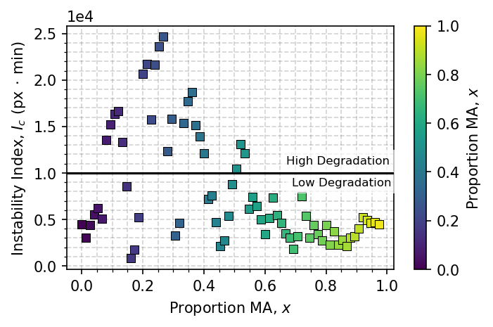
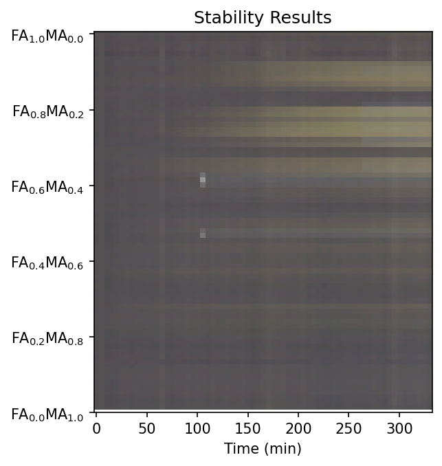

# Automatic-Stablity-Measurement
______________________________________________

# Table of Contents
- [Package Description](#description)
- [Installation](#installation)
- [Usage](#usage)

# Description:

This package automatically measures the stability from vision-segmented RGB images of semiconductor samples.

**Steps for Measuring Stability:**

- Each RGB image is segmented using vision to locate the pixels of each individual sample.
- The segmented pixels are color-corrected using a calibration card.
- The change in color for each sample over time is logged.
- For each sample, the instability index is computed over time and the results are visualized.

# Installation

Package installation requirements can be found in the [requirements.txt](./requirements.txt) file.

# Usage

A demonstration of using the automatic stability measurement package can be found in the [RunStability.ipynb](./RunStability.ipynb) file. The functions used in this package can be found in the [stability.py](./stability.py) file.

Input data should take the form of a sequence of RGB images over time for all samples. An example set of temporal images are provided in the [sample-data/images](./sample-data/images/) folder. Once the data files are input, the user must only define a set of crop/rotation parameters to set the vision-segmentation boundaries. The rotate/crop parameters the the form of a dictionary: `rotate_crop_params = {'theta': -0.5, 'x1': 45, 'x2': 830, 'y1': 120, 'y2': 550}`, where `theta` defines the rotation, `x1` and `x2` define the x-limits, and `y1` and `y2` define the y-limits. 

After providing the data files paths and the crop/rotation parameters, the [stability.py](./stability.py) and the [RunStability.ipynb](./RunStability.ipynb) will automatically segment all samples and compute the instability index of each sample, over the course of the degradation experiment. The output results are shown below.

| Instability Index | Temporal Stability |
| ---------- | ----------- |
|  |  |

